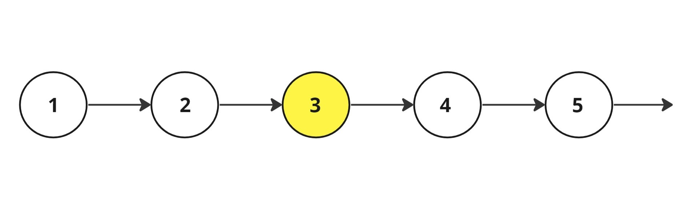

<h2> Middle Of Linked List</h2>
<h3>Problem Statement</h3>

Given a singly linked list of 'N' nodes. The objective is to determine the middle node of a singly linked list. However, if the list has an even number of nodes, we return the second middle node.

<h2>Detailed Explanation</h2>

<strong>Sample Input 1:</strong>

<pre><code>5
1 2 3 4 5
</code></pre>

<strong>Sample Output 1:</strong>

<pre><code>3 4 5
</code></pre>

<strong>Explanation Of Sample Input 1:</strong>

We can clearly see that there are 5 elements in the linked list, therefore the middle node is the node with value '3'.

<strong>Sample Input 2:</strong>

<pre><code>6
1 2 3 4 5 6
</code></pre>

<strong>Sample Output 2:</strong>

<pre><code>4 5 6
</code></pre>

<strong>Explanation Of Sample Input 2:</strong>

We can clearly see that there are 6 elements in the linked list and the middle nodes are nodes with values 3 and 4, hence we return a second middle node having value '4'.

<h2>Constraints:</h2>
<ul>
    <li>1 <= 'N' <= 104</li>
    <li>0 <= 'data' <= 103</li>
</ul>

Where 'N' is the length of the linked list.

<strong>Time Limit:</strong> 1 sec

